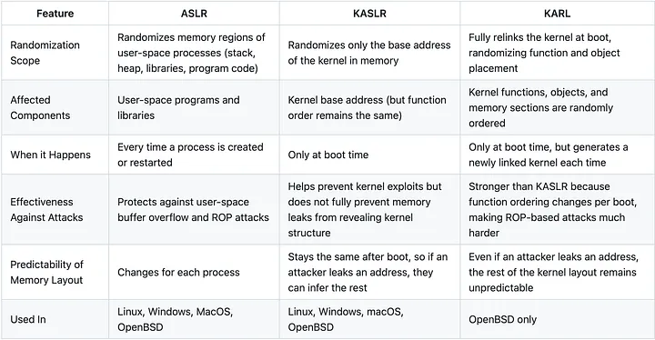

# ASLR, KASLR and KARL.<br>
they are all security techniques to mitigate attacks related to kernel.

## ASLR
ASLR or Address Space Randomization Layout is the security feature built into the OS that randomizes memory location of main system applications/processes, shared librarires, stack and heap memoy space of those applications.<br>
It prevents attacker to access function's return code of the loaded apps, to be able to load their payload right into the system or even it could be through buffer overflow in which attacker tries to overwrite applications data through overwriting the buffer (maybe aimed to change the function's return code to address to desired malicious code).even if the attacker tries the brute force to find that specific memory address it will cause the process to crash each time it addresses the worng place, and also could cause alert of suspicious activity if SOC teams consider such these things.<br>
Each time the OS reboots, memory location addressses of processes, stack and heap memory space and shared libraries are relocated at a different randomized location. 
> [!NOTICE]
> Memory addresses are chosen once when a new process is created (specifically during execve()), and they remain fixed for the lifetime of that process.

### enable and configuration of ASLR
ASLR is controlled via `randomize_va_space` kernel parameter.
```
sysctl kernel.randomize_va_space
```
this parameter has three levels that could be set as its value:
- `0` = ASLR is disabled and all memory regions are fixed addresses.
- `1` = ASLR is enabled on stack memory space, shared libraries, VDSO but not on heap.
- `2` = ALSR is fully enabled on stack and heap memory spaces, shared libraries and VDSO.
configure:
```
# make persistant accross the reboot
$ echo 'kernel.randomize_va_space = 2' | sudo tee /etc/sysctl.d/99-aslr.conf

# Apply via sysctl.conf or /etc/sysctl.d/*.conf system
sudo sysctl --system
```

## KASLR
KASLR or Kernel Address Space Layout Randomization is simply adding ASLR feature on kernel at boot time when it is about to load to memory.<br>
It means that the kernel code location in memory is randomized each time **(it only gets a new random memory address per each reboot)**.<br> 
because of one time address randomization per each time boot, its been a bit of debaits about how much effective KASLR is.<br> 
because rebooting the system is not something you could do regularly to ensure the security so if an attacker could find memory leak, he could take advantage of this consistant and bypass the KASLR. although the nature of ASLR is at start time or in KASLR at boot time and this is how it works.

two methods for by-passing the KASLR (or in general the ASLR):
- brute force the address location which is noisy and identifiable by security teams due to multiple times of attempts and causing the restart or reboot of system.
Each time attcker try a new address it could be a location of random part of memory and unralated to what application address is targeted on leading to cause a crash to kernel and eventually the reboot.
- leak one pointer (memory leak) : it is done through a memory leak in a way that kernel base address will be calculated and found. then from the leaked pointer address found in memory leak, any function's memory location is possible to be calculated.

### how leak one pointer attack works:
you already know when the kernel loads in memory it has a base memory location and everything in kernel like functions and etc are loaded inside kernel. so each component's memory address be like *kernel_base + functions_offset = functoins_pointer_in_memory*.<br>
for example kernel is loaded at 
```
0xffffffff82400000
```
functions and objects are accrodingly loaded at:
```
Address                 Object
--------------------------------------------------------
0xffffffff82400000      Kernel base
0xffffffff82408f20      start_kernel() function
0xffffffff8248f430      commit_creds() function
0xffffffff8248f730      prepare_kernel_cred() function
0xffffffff8265a100      task_struct for the current process
```
when KASLR is enabled the kernel base is in different location in each boot. attacker doesnt know about the kernel base so he/she cant calculate the pointer but now if a pointer is leaked (informaiton leak) by a currupt kernel module or use-after-free vulnerability or any other method, they can calculate the kernel base;<br>
how? suppose the leaked pointer is:
```
0xffffffff8248a100
```
and the attacker also has kernel binary so he knows trask_struct is always `0x8a100` bytes after kernel base. now he/she could calculate kernel base and bypass KASLR:
```
0xffffffff8248a100  --> pointer
 -
0x8a100 -->  e.g. task_struct offset
 = 
0xffffffff82400000  --> kernel_base
```
now attacker could compute any function's memory location in kernel. for example `commit_creds()` kernel funciton could be computed like:
```
0xffffffff82400000  --> kernel_base
 + 
0x950000  --> commit_creds() offset
 =  
0xffffffff82495000  --> function's location in memory
```

## KARL
Kernel Address Randomized Link. each time kernel binary loads to memory and system boots up, kernel components like functions, objects and internal files are in fixed places of memory according to kernel base. by KARL kernel's objects, internal files and more are distributed in random order each time the system updates or restarts. resulting the system to boot with a unique kernel defferent from others at binary level. 

this feature is announced by Open BSD and unfortunately it is only available on Open BSD.

## difference between ASLR KASLR and KARL
