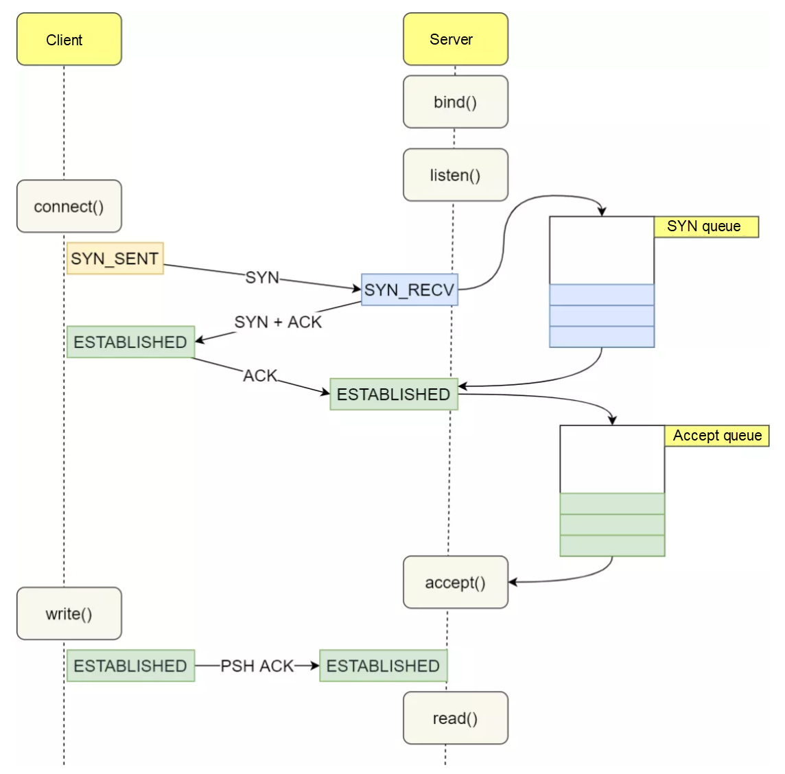

# overal procedure

when the server wants to listen on a incomming tcp connection on port for example 443 it performs these system calls: 
1. `socket()` creates a socket as the comunication endpoint.
2. `bind()` will assign a local IP address and port to that endpoint socket.
3. `listen()` marks the socket as a passive socket which means it is listening now. it also have an argument which is called **backlog** that determines maximum number of pending connections in accept queue.
4. `accept()` this will remove the pending connection from the accept queue and returns the new created socket form comunicating with that client.

the SYN Queue (syn_backlog) and the Accpet Queue (backlog) are both exist inside the kernel and are seprated from the application side.

the application side calls the system call wrappers like `socket()`, `bind()`,`listen()`, `accpet()`.


# consider an example
steps to show how application and kernel sides work when client tries to connect to server:

## step1 `socket()`
the application make the system call to kernel so the kernel creates the socket object.

## step2 `bind()`
application --> systemcall --> local IP address and the port is assigned to the socket.

## step3 `listen()`
here the queues becommes important.

first the application --> systemcall --> socket beomes a listening socket

internally the kernel creates a data structure and both queues will belong to the listening socket inside the kernel:
```
Listening Socket
      |
      +---- SYN Queue (syn_backlog)
      |
      +---- Accept Queue (backlog)
```

## step4 - the client sends SYN
connection is no established yet so kernel creates a half-open connection and place the syn connection in SYN queue.

## step5 - TCP handshake is complete
kernel moves the connection form the SYN queue to the Accept queue.

at this point the application still doesnt know about the connection yet.

## step6 - `accept()`
the application --> systemcall --> in the kernel it looks at the accept queue. it removes the connection from there and creates a new socket for it:
```
Listening Socket (still listening)
        |
        +---- Accept Queue
                (empty)

New Connected Socket 
        |
        +---- Client A connection
```

the newly created socket through accpet() is considered because what if the server wants to keep listening on that port (listening socket created by applicatoin at first).
so for each new connection there will be a new socket created after accpet() accepts it.

at this point the application can recieve client_fd from the client

# related kernel parameter
## net.core.somaxconn
the value of the somaxconn determines the size of *backlog* or *Accept queue*.

check its value:
```
sysctl net.core.somaxconn
```
the default value is too small and needs to be increased. also as the value of somaxconn increases the value of tcp_max_syn_backlog also needs to be increased accordingly.<br>
good practice on production servers to set the these values for parametes:
```
cat > /etc/sysctl.d/99-tcp-backlog.conf << 'EOF'
net.core.somaxconn = 65535
net.ipv4.tcp_max_syn_backlog = 65535
net.ipv4.tcp_syncookies = 1
EOF
```

> [!WARNING]
> for changes to take affect better you also need to configure the value in your application too. for example consider nginx here:

set the backlog value in your nginx configuration:
```
events {
    worker_connections 65535;
}

http {
    listen 80 backlog=65535;
    listen 443 backlog=65535;
}
```
